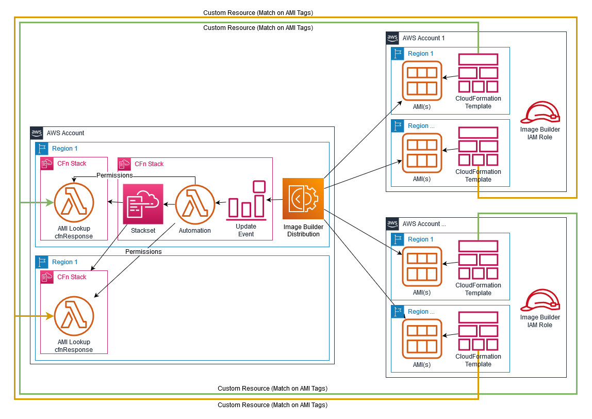
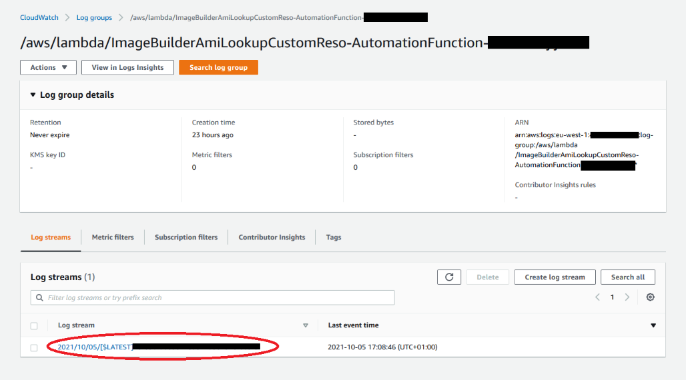
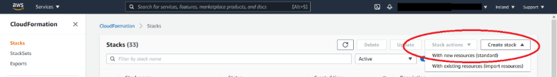
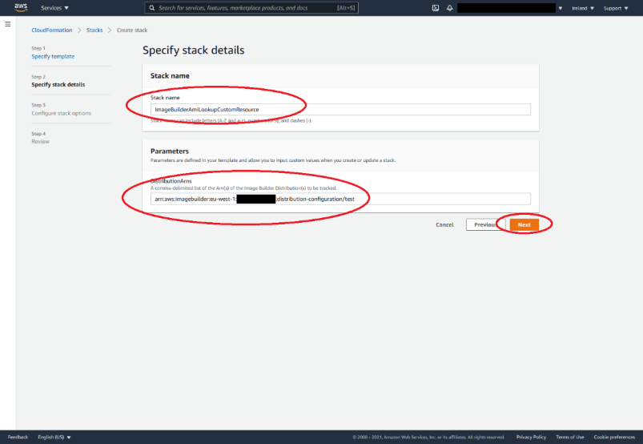
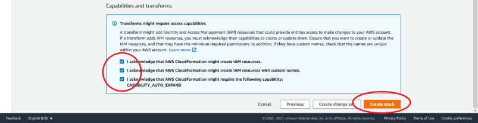
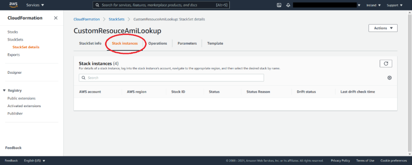
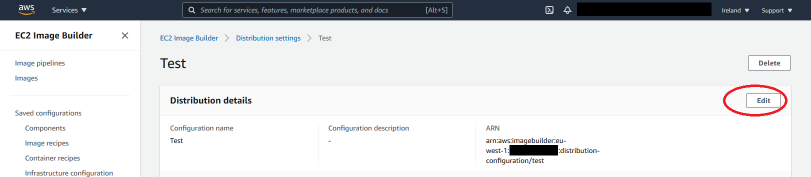
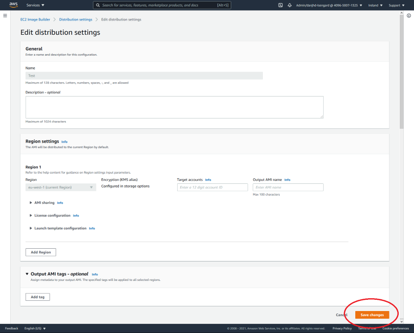
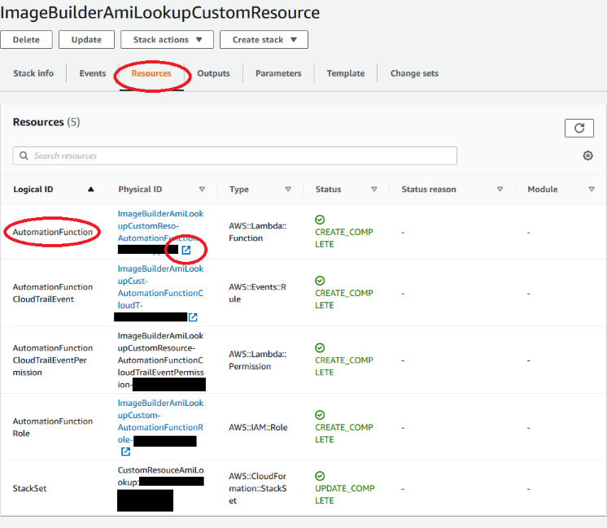
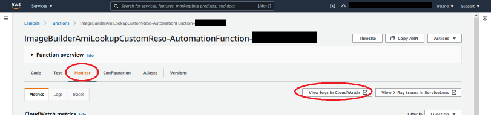

# How to find the latest AMI deployed by EC2 Image Builder

## A solution to automate AWS Lambda functions as Custom Resources to allow lookup of AMIs deployed (or shared) using Image Builder.

[EC2 Image Builder](https://aws.amazon.com/image-builder/) is a service available on AWS to automate the building and deploying of Custom AMIs across AWS regions and AWS accounts. It allows an organisation to build *approved* AMIs (Amazon Machine images) in a centrla account and push them out to be consumed by other AWS accounts in any required region.

The EC2 Image Builder has the concept of a Distribution Configuration that is used to define which Regions and AWS accounts the newly built AMIs shoudl be deployed to. The deployment can be achieved in one of two ways:

  1) By **sharing** the AMI with the target accounts/regions, this means only one copy of the AMI exists per region and the other accounts use the AMI as a shared resource.
  2) By **copying** the AMI to the target accounts/regions, this means multiple copies of the AMI are produced and the target accounts/regions now have their own copy separate to the source account.

Due to this great functionality and flexibility EC2 Image Builder is a very popular AWS Service. However if the target accounts use [AWS CloudFormation](https://aws.amazon.com/cloudformation/) determining the latest *approved* AMI to use when creating or updating a Stack can eb a challenge, with potentially different solutions being built in different accounts adn the fact the accounts are having to solve the problem themselves.

This article supplies a solution to this problem. It does so by proposing the use of [CloudFormation Custom Resources](https://docs.aws.amazon.com/AWSCloudFormation/latest/UserGuide/template-custom-resources.html) in the target accounts to be able to *lookup* the latest AMI whenever needed easily. However Custom Resources can be tricky to create and maintaing since it needs someone to create the code/logic to perform the lookup. In this solution we will be showing you how to deploy this code centrally once (per region) in the AWS account that runs the Image Builder and give access to the target accounts to use it. Therefore no additional resources need to be deployed into the target accounts they just need the correct syntax to be able to make use of it. Another part of this solution will show how we *link* the **Distribution Configuration** to this solution so that when any changes are made to the target accounts/regions the resources are updated automatically without any human intervention.

So lets' get started with an overview of the components in this solution:

  - AWS CloudWatch Event
    - This event will be triggered (using CloudTrail) when the `UpdateDistributionConfiguration` API is called. This allows us to track any changes to a prefined Distribution Configuration(s).
  - AWS Lambda function (Python)
    - This function is the "brains" of the solution it makes sure that the resources required are deployed correctly and sync'd with the Distribution Configuration.
  - CloudFormation StackSet (This Stackset will be used to deploy the regional components of the solution)
    - The Stacks within the Stackset will consist of a further Lambda function that is the function called by the CloudFormation Custom Resource in the target accounts/regions. It needs to be deployed once per region since whilst Custom Resources can call "cross account" they cannot call "cross region".

The entire solution will be deployed with a single CloudFormation Stack that can be found in this repository. When deploying the stack there is only one parameter required and that is the ARN of the Distribution Configuration(s).

The following shows a diagram of the solution
**Note**:  This diagram actually shows the scenario where Image Builder is copying AMIs).


## 1 - Deploying the solution into an account.

- Navigate to the Distribution Configuration area of the [Image Builder Console](https://console.aws.amazon.com/imagebuilder/home#/distributionSettings) in your AWS Account that is running the Image Builder. (Ensure you are in the desired region). Locate the Distribution Configuration that you wish to link to this solution and select it. Once selected you will be takewn to a details page where you will see the ARN of the Distribution Configuration copy this ARN you will need it in the next step. Repeat this process of other Distributions if you use more than one.



- Now navigate to the [CloudFormation Console](https://console.aws.amazon.com/cloudformation/home) in the same account in the same region. Choose *Create Stack* from the top right and *With new resources (standard)*:



- Choose *Upload a template* from the lower section and browse to where you downloaded the template from this repository. At this point you will need to make a choice depending on how you are deploying your AMIs. Two different templates are supplied:
  - `template-copied-amis.yaml` for where your Distribution Configuration is setup to **copy** AMIs into the target accounts/regions
  - `template-shared-amis.yaml` for where your Distribution Configuration is setup to **share** AMIs into the target accounts/regions


- Enter a Stack name, we have chosen `ImageBuilderAmiLookupCustomResource`, but you can choose any valid name you prefer. In the parameters sections paste the ARN(s) of the Distribution Configuration(s) you wish to use. If you are supplying more that one use a comma as a separator. Then click *next*.



- Click *next* once more and then scroll to tbe bottom of the page, check the 3 checkboxes and finally click *create stack*



- Now we just need to wait a couple of minutes for `CREATE_COMPLETE` on the stack.

## 2 - Reviewing the resources

Before we proceed to the next step of the deployment we should take a moment to review what has been deployed.

Navigate to the [CloudFormation Stacksets Console](https://console.aws.amazon.com/cloudformation/home#/stacksets) in the same account in the same region. You will see that we now have a Stackset called *CustomResouceAmiLookup* (or a new one if you already have some). Take a look at the existing Stack instances and you will see there are none. This is because we have deployed the solution but as yet it has not been configured.



## 3 - Initial population

So now we need to trigger the automation for the first time. To do this we just need to edit the Distribution Configuration(s). Navigate to the [Image Builder Console](https://console.aws.amazon.com/imagebuilder/home#/distributionSettings) in your AWS Account that is running the Image Builder. (Ensure you are in the desired region). Locate the Distribution Configuration(s) that you supplied in the Stack creation earlier click on them to view the detials and then select *edit*.



Once on the edit screen just scroll all the way to the bottom without changing anything and click *save" this will call the `UpdateDistributionConfiguration` API and in turn trigger our Lambda function.



**Repeat this step for all the required Distribution Configurations**

## 4 - Review the automation

We are now able to view the logs of the Lambda function that was executed to show what action was taken.

First navigate to the [CloudFormation Console](https://console.aws.amazon.com/cloudformation/home) and locate the Stack we created earlier. Once you have found it select the *Resources* tab and locate the link for the `AutomationFunction` and click it to navigate to it.



Once redirected to the Lambda function click the *Monitor* tab and then click the *View logs in CloudWatch* to open the logs for the automation function.



Finally once in the CloudWatch console locate the log streams towards the bottom of the page and click the top one to view the details.


This view now shows you the logs from the automation Lambda function. It is the place you can come to to view the changes that were made to the resources as a result of changes to a Distribution Configuration. These logs show:
- The input event, this gives the raw detail of what update event triggered the function to run, useful in seeing what data the automation function was acting on.
- The regions that were added (or removed) from the Stackset so that the AMI Lookup Lambda functions were added or removed.
- The details of the accounts that were given (or revoked) permissions to call that AMI lookup Lambda function.

Now that you can see the Lambda function exceuted you can (optional) repeat step 4 above to review the Stack Instances in the StackSet. You should now see one stack for each region covered by your Distribution Configuration(s).

The stackset has now deployed a Lambda function with a hardcoded name `CustomResourceAmiLookup` into each relevant region in this account (the account that contains the Image Builder).

## 5 - Review the CustomResourceAmiLookup Lambda function

If you wish to review the actual code for this Lambda function feel free to do so. It is written in Python and should be pretty easy to follow if you "speak Python". In this section we will describe exactly what it does so that it can be understood how it works. This function is written to use the standard format used by a CloudFormation Custom Resource Lambda function. As such it can take input paramaters directly from a CloudFormation Template.
In this case the only parameter used is a `Tags` parameter. This parameter is a list of AWS tags. An example of how to format this is shown later.
The Lambda function uses the `DescribeImages` API to list the AMIs that have matching tags to those provided in the Parameters. The way it calls the `DescribeImages` API differs slightly depending on which template you deployed above:
  - `template-copied-amis.yaml` The Lambda function first assumes the IAM Role called `EC2ImageBuilderDistributionCrossAccountRole` [link](https://docs.aws.amazon.com/imagebuilder/latest/userguide/cross-account-dist.html) in the target account before it calls `DescribeImages`. This means that the AMIs the Lambda function returns are ones available in the target account.
  - `template-shared-amis.yaml` In this scenario an assume role is not needed instead it calls `DescribeImages` in it's own account. This is because these AMIs are only shared and so cross account access is not rewuired. This Lambda function also verifies the AMIs returned have been shared with the account to ensure no non-shared AMIs matching the tags will be returned.
Finally once it has a list of AMIs the Lambda function finds the most recent one (using `CreationDate`) and returns just that AMI as a Json object. This in turns gets returned to CloudFormation for us.

### 6 - Consuming the Custom Resource

In order to make use of this solution in a target account the user needs to add a new resource to their existin CloudFormation template. This resource is known as a Custom Resource and takes the format of:

```yaml
  Ami1:
    Type: Custom::AmiLookup
    Properties:
      ServiceToken: !Sub 'arn:aws:lambda:${AWS::Region}:111122223333:function:CustomResourceAmiLookup'
      Tags:
        - Key: CreatedBy
          Value: EC2 Image Builder
        - Key: Type
          Value: Hardened OS
```

The name of the resource (`Ami1`) can be named as anything the user requires. The Custom Resource type (`AmiLookup`) can also be any allowed name. The value in the `ServiceToken` is important as this is what tells CloudFormation which Lambda function to invoke. The only part that should be changed from this example is that `111122223333` should be changed to match the account id where the Image Builder is running. Finally the Tags property should be modified as required. With as many tags as required to match the AMI the user requires. This resource type can be used as many times as required in the same template to retrieve different AMIs as required.

Once the resource is added to a template it then needs to be consumed by another resource, for example an EC2 instance:

```yaml
  MyEC2Instance:
    Type: AWS::EC2::Instance
    Properties: 
      ImageId: !GetAtt Ami1.ImageId
      KeyName: "testkey"
      BlockDeviceMappings: 
      - DeviceName: "/dev/sdm"
        Ebs: 
          VolumeType: "io1"
          Iops: "200"
          DeleteOnTermination: "false"
          VolumeSize: "20"
      - DeviceName: "/dev/sdk"
        NoDevice: {}
```

Here you can see the ImageId property has been set to get the ImageId from the attributes of the `Ami1` resource. It's that simple! In case more expansive use cases are required the objefct returned by the Custom Resource contains more than just the ImageId property it's structure matches the full details of the AMI as defined [here](https://docs.aws.amazon.com/AWSEC2/latest/APIReference/API_Image.html).

So for example if the user wanted to know the `CreationDate` of the AMI returned they would use `!GetAtt Ami1.CreationDate`
